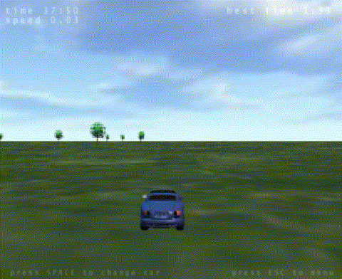
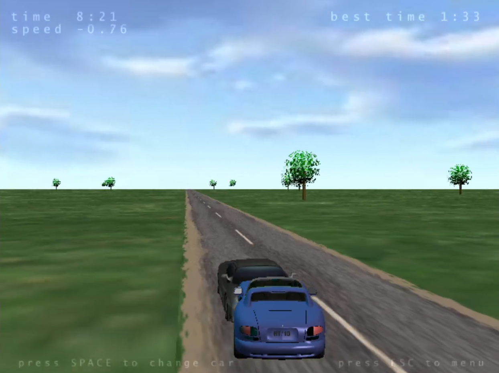

# Отчет по тестированию №1. Список найденных багов в dullrace2
Сергеев М.И.  
гр. 11-207

Вставлены gif, потому что vs-code принципипльно не поддерживает вставку видео, а github не хочет отображать это дело из-за размера.

1. Рекорд не сохраняется  
    #### Условия воспроизведения:
    - Завершить игру за время, меньшее лучшего текущего времени;
    - Начать игру заново.  
    #### Фактический результат:
    Рекорд не сохраняется.  
    
    #### Ожидаемый результат:
    Рекорд сохраняется и отображается в "best time".
2. Внутриигровая музыка перестает воспроизводится  
    #### Условия воспроизведения:  
    - Дождаться окончания композиции;
    - Начать игру заново.  
    #### Фактический результат:
    Композиция больше не воспроизводится.  
    [видео-демонстрация](./2.mp4)
    #### Ожидаемый результат:  
    Композиция начинается заново.
3. Езда задом быстрее езды передом   
    #### Условия воспроизведения:
    - Поехать вперед и разогнаться:
    - Поехать назад и разогнаться.
    #### Фактический результат:
    Езда задом быстрее езды передом на 0.10 как по асфальту, так и по земле. Разгон осуществляется задом также быстрее.  
    
    #### Ожидаемый результат:  
    Езда передом быстрее езды задом как по асфальту, так и по земле. Разгон осуществляется передом также быстрее.
4. Дрифт на месте 
    #### Условия воспроизведения:
    - Остановиться
    - Нажать кнопку влево/вправо, не нажимая кнопку вперед.
    #### Фактический результат:
    Машина поворачивается на месте.  
    
    #### Ожидаемый результат:  
    Машина не поворачивается на месте (допустим поворот колес).
5. Выход за пределы карты  
    #### Условия воспроизведения:
    - Отъехать от дороги на некоторое расстояние;
    - Повернуться к отметке финиш задом, так чтобы машина стояла параллельно дороге;
    - Ехать назад до упора.
    #### Фактический результат:
    Машина выезжает за линию финиша.  
    
    #### Ожидаемый результат:  
    Машина не выезжает за линию финиша.
6. Машина застревает после коллизии  
    #### Условия воспроизведения:
    - Упереться в невидимую стену за стартом
    - Дождаться столкновения с проезжающей машиной
    #### Фактический результат:
    Машина застревает в невидимой стене.  
    
    #### Ожидаемый результат:  
    Машина не застревает в невидимой стене.
7. Инерция двигает автомобиль вперед, даже если он едет назад 
    #### Условия воспроизведения:
    - Ездить попеременно вперед и назад на неболбшое расстояние (пол-секудны).
    #### Фактический результат:
    Машина получает инерцию вперед 0.03; при езде назад и последующей остановке инерция вперед не пропадает.
    
    #### Ожидаемый результат:  
    При езде назад и последующей остановке появляется инерция назад/не появляется инерция.
8. Автомобиль застревает в дереве 
    #### Условия воспроизведения:
    - Поступательно врезаться в дерево на протяжении нескольких секунд.
    #### Фактический результат:
    Машина застревает в дереве.
    
    #### Ожидаемый результат:  
    Машина не застревает в дереве.
9. Автомобиль проезжает через дерево
    #### Условия воспроизведения:
    - Поступательно врезаться в дерево на протяжении нескольких секунд.
    #### Фактический результат:
    У дерева пропадает коллизия. Причем пропадает только у одного. Автомобиль может проезжать через дерево.
    
    #### Ожидаемый результат:  
    У дерева не пропадает коллизия. Автомобиль может не может проезжать через дерево.
10. Модели автомобилей при столкновении некорретно отображаются
    #### Условия воспроизведения:
    - Столкнутья с другим автомобилем.
    #### Фактический результат:
    Модели автомобилей просто накладываются друг на друга.
    
    #### Ожидаемый результат:  
    Автомобили отталкиваются.
